# Email Sync System - Current Architecture Issues

This document visualizes the architectural problems in the current Email Sync system using Mermaid diagrams. These diagrams will render automatically when viewed on GitHub.

## 1. The Split-Brain Data Architecture Problem

```mermaid
graph TB
    subgraph "Current Split-Brain Architecture"
        Gmail[Gmail Service] --> ContentTable["content table<br/>UUID IDs<br/>453 records"]
        PDF[PDF Service] --> UnifiedTable["content_unified table<br/>Integer IDs<br/>1,005 records"]
        Upload[Upload Service] --> UnifiedTable
        
        ContentTable -.->|"❌ No Connection"| Embeddings[Embedding Generation]
        UnifiedTable -->|"✓ Connected"| Embeddings
        
        Embeddings -->|"18.6% success"| VectorStore[Qdrant Vector Store]
        
        ContentTable -.->|"❌ Not Searchable"| Search[Search Service]
        VectorStore --> Search
        
        style ContentTable fill:#ffcccc
        style Gmail fill:#ffcccc
        style Embeddings fill:#ffffcc
    end
```

## 2. The Broken Pipeline Flow

```mermaid
flowchart LR
    subgraph "What Should Happen"
        A1[Document Input] --> B1[Process & Store]
        B1 --> C1[Generate Embedding]
        C1 --> D1[Vector Store]
        D1 --> E1[Searchable]
        
        style A1 fill:#ccffcc
        style B1 fill:#ccffcc
        style C1 fill:#ccffcc
        style D1 fill:#ccffcc
        style E1 fill:#ccffcc
    end
    
    subgraph "What Actually Happens"
        A2[Document Input] --> B2[Process & Store]
        B2 -.->|"❌ BREAKS HERE"| C2[Generate Embedding]
        C2 -.-> D2[Vector Store]
        D2 -.-> E2[Not Searchable]
        
        B2 -->|"Manual Script Required"| Manual[Human runs<br/>generate_missing_embeddings.py]
        Manual --> C2
        
        style C2 fill:#ffcccc
        style D2 fill:#ffcccc
        style E2 fill:#ffcccc
        style Manual fill:#ffffcc
    end
```

## 3. The Configuration vs Reality Mismatch

## 4. The Service Coordination Chaos

```mermaid
graph TB
    subgraph "Services Don't Know About Each Other"
        Gmail[Gmail Service]
        PDF[PDF Service]
        Upload[Upload Service]
        Embedding[Embedding Service]
        Vector[Vector Store Service]
        Search[Search Service]
        
        Gmail -.->|"❌ No coordination"| Embedding
        PDF -.->|"❌ No coordination"| Embedding
        Upload -.->|"❌ No coordination"| Embedding
        
        Embedding -.->|"❌ No automatic trigger"| Vector
        
        Human[Human Operator]
        Human -->|"Manually coordinates"| Gmail
        Human -->|"Manually coordinates"| PDF
        Human -->|"Manually runs scripts"| Embedding
        Human -->|"Monitors failures"| Vector
        
        style Human fill:#ffffcc
        style Embedding fill:#ffcccc
    end
```

## 5. The Adapter Band-Aid Mess

```mermaid
graph LR
    subgraph "Current Band-Aid Architecture"
        Service1[Gmail Service] -->|"Expects save_to_db"| Adapter1[DB Adapter]
        Adapter1 -->|"Translates"| DB1[SimpleDB]
        
        Service2[Vector Service] -->|"Expects get_all_content_ids"| Adapter2[Method Adapter]
        Adapter2 -->|"Shims missing method"| DB1
        
        Service3[Pipeline] -->|"Expects batch_mark_vectorized"| Adapter3[Batch Adapter]
        Adapter3 -->|"Wraps missing method"| DB1
        
        DB1 -->|"Missing methods"| Missing["❌ get_all_content_ids<br/>❌ batch_mark_vectorized<br/>❌ mark_content_vectorized"]
        
        style Adapter1 fill:#ffffcc
        style Adapter2 fill:#ffffcc
        style Adapter3 fill:#ffffcc
        style Missing fill:#ffcccc
    end
```

## 6. The Document Processing State Machine (Broken)

```mermaid
stateDiagram-v2
    [*] --> Ingested: Document arrives
    Ingested --> Stored: Save to database
    Stored --> Processed: Extract entities/summary
    Processed --> Embedded: Generate embeddings ❌
    Embedded --> Indexed: Store in Qdrant
    Indexed --> Searchable: Available for search
    
    Processed --> Stuck: No automatic trigger
    Stuck --> Manual: Human runs script
    Manual --> Embedded: Finally generates
    
    note right of Stuck
        818 documents stuck here
        99.2% failure rate
    end note
    
    note right of Manual
        Requires human intervention
        Single point of failure
    end note
```

## 7. The Impact on Legal Work

```mermaid
graph TD
    subgraph "Search Query Flow"
        Query["Search: 'contract dispute'"] --> Engine[Search Engine]
        
        Engine --> Check1{Has Embedding?}
        Check1 -->|"Yes (18.6%)"| Semantic[Semantic Search<br/>Finds related concepts]
        Check1 -->|"No (81.4%)"| Keyword[Keyword Only<br/>Exact match only]
        
        Semantic --> Found1["✓ Finds:<br/>• agreement conflicts<br/>• contractual disagreements<br/>• breach of contract"]
        
        Keyword --> Found2["❌ Misses:<br/>• 'agreement conflict'<br/>• 'contractual disagreement'<br/>• 'breach' without 'contract'"]
        
        style Check1 fill:#ffffcc
        style Keyword fill:#ffcccc
        style Found2 fill:#ffcccc
    end
    
    subgraph "Business Impact"
        Impact["⚠️ 818 documents invisible to semantic search<br/>⚠️ Critical case information may be missed<br/>⚠️ Manual review required for confidence"]
        style Impact fill:#ff9999
    end
    
    Found2 --> Impact
```

## 8. The Complete System Architecture (Current State)

```mermaid
graph TB
    subgraph "Input Layer"
        GmailAPI[Gmail API]
        PDFUpload[PDF Upload]
        FileUpload[File Upload]
    end
    
    subgraph "Processing Layer - FRAGMENTED"
        GmailAPI --> GmailService[Gmail Service]
        PDFUpload --> PDFService[PDF Service]
        FileUpload --> UploadService[Upload Service]
        
        GmailService --> ContentDB["content table<br/>(UUID IDs)"]
        PDFService --> UnifiedDB["content_unified table<br/>(Integer IDs)"]
        UploadService --> UnifiedDB
    end
    
    subgraph "AI Processing - PARTIALLY BROKEN"
        UnifiedDB --> EntityExtraction[Entity Extraction ✓]
        UnifiedDB --> Summarization[Summarization ✓]
        UnifiedDB --> Timeline[Timeline ✓]
        UnifiedDB -.->|"❌ No trigger"| EmbeddingGen[Embedding Generation]
        ContentDB -.->|"❌ Not connected"| EmbeddingGen
        
        ManualScript["🔧 Manual Script<br/>generate_missing_embeddings.py"]
        ManualScript --> EmbeddingGen
    end
    
    subgraph "Storage Layer"
        EmbeddingGen --> Qdrant[Qdrant Vector DB<br/>187/1005 vectors]
        EntityExtraction --> MainDB[SQLite Main DB]
        Summarization --> MainDB
        Timeline --> MainDB
    end
    
    subgraph "Search Layer - LIMITED"
        Qdrant --> SearchService[Search Service]
        MainDB --> SearchService
        SearchService --> Results["⚠️ 18.6% Semantic Coverage<br/>⚠️ 81.4% Keyword Only"]
    end
    
    style ContentDB fill:#ffcccc
    style EmbeddingGen fill:#ffcccc
    style ManualScript fill:#ffffcc
    style Results fill:#ff9999
```

## Summary of Core Issues

### Issue 1: Split-Brain Data Architecture
- Two incompatible storage systems (content vs content_unified)
- Different ID systems (UUID vs Integer)
- Gmail emails isolated from modern pipeline

### Issue 2: Broken Automation
- No automatic trigger from content storage → embedding generation
- Requires manual script execution
- 818 documents stuck without embeddings

### Issue 3: Configuration Drift
- Config file says 768 dimensions, code uses 1024
- System ignores configuration
- Works by accident, not design

### Issue 4: Service Isolation
- Services don't coordinate
- No event system or pipeline orchestration
- Human operator is the integration layer

### Issue 5: Band-Aid Architecture
- Multiple adapters covering missing functionality
- Shims and wrappers instead of proper interfaces
- Technical debt compounds with each fix

## Impact Metrics

- **99.2%** embedding generation failure rate
- **818** documents missing semantic search capability
- **81.4%** of searches limited to keyword-only matching
- **2** incompatible data storage systems
- **100%** manual intervention required for embeddings

---

*These diagrams automatically render on GitHub. To view them locally, use VS Code with the "Markdown Preview Mermaid Support" extension or visit [mermaid.live](https://mermaid.live) to render them online.*