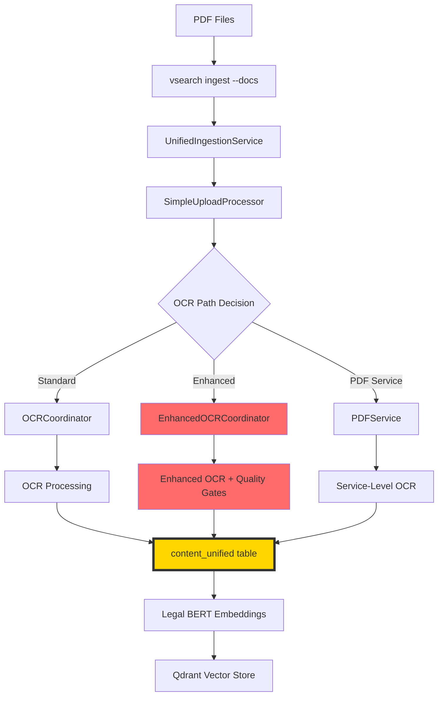

# PDF OCR System Analysis - Complete Script Inventory & Rebuild Recommendation

## Executive Summary

The current PDF OCR system contains **15 OCR-related scripts totaling 2,697 lines of code** across three tiers. Analysis reveals significant over-engineering with **862 lines of redundant "enhanced" functionality** that provides minimal benefit while creating maintenance complexity. The system implements duplicate OCR pathways, unnecessary abstraction layers, and complex quality gates that often cause more failures than they prevent.

**Recommendation**: Complete rebuild with ~200 lines of focused code.

---

## Complete Script Inventory

### **TIER 1: Core OCR Engine (pdf/ocr/ directory)**

| Script | Lines | Role | Key Dependencies |
|--------|-------|------|------------------|
| `ocr_coordinator.py` | 120 | Primary OCR Pipeline Orchestrator | OCREngine, PDFValidator, PDFRasterizer |
| `ocr_engine.py` | 186 | Core Tesseract OCR Wrapper | pytesseract, PIL, cv2 |
| `validator.py` | 123 | OCR Necessity Detector | PyPDF2 |
| `rasterizer.py` | 102 | PDF to Image Converter | pdf2image |
| `postprocessor.py` | 179 | OCR Text Cleaner | re (regex) |
| `page_processor.py` | 187 | Memory-Efficient Large PDF Processor | OCREngine, OCRPostprocessor |
| `loader.py` | 90 | PDF File Operations Handler | hashlib, pathlib |
| **Subtotal** | **1,087** | **Core OCR functionality** | |

### **TIER 2: Enhanced OCR System (Redundant)**

| Script | Lines | Role | Redundancy Issue |
|--------|-------|------|------------------|
| `enhanced_ocr_coordinator.py` | 438 | Quality-Gated OCR Pipeline | Wraps standard coordinator |
| `enhanced_ocr_engine.py` | 424 | Advanced OCR with Pre-processing | Wraps standard engine |
| **Subtotal** | **862** | **Redundant enhanced functionality** | |

### **TIER 3: Integration & Utility Scripts**

| Script | Lines | Role | Integration Point |
|--------|-------|------|-------------------|
| `pdf_processor_enhanced.py` | 182 | OCR-Integrated PDF Processor | Unified pipeline connection |
| `pdf/main.py` | 651 | PDF Service Facade | Service-level OCR access |
| `content_quality_scorer.py` | 249 | OCR Quality Validation | Quality gate implementation |
| `document_converter.py` | 371 | Document Pipeline Integration | Infrastructure integration |
| Test files | 457 | OCR Integration Testing | Testing frameworks |
| **Subtotal** | **1,910** | **Integration layer** | |

**Total System: 3,859 lines across 15 files**

---

## OCR Pipeline Flow & Integration Points

### **Data Flow: PDF → OCR → content_unified → Vector Embeddings**



### **Integration Points**

1. **SimpleUploadProcessor** (`shared/simple_upload_processor.py:206-254`)
   - Primary entry point for `vsearch ingest --docs`
   - Calls PDF service OCR coordinator
   - Stores results in `content_unified` table

2. **PDFService** (`pdf/main.py:233-274`)
   - Direct OCR processing via `self.ocr.process_pdf_with_ocr()`
   - Formats OCR results with metadata
   - Integration with chunk storage

3. **EnhancedPDFProcessor** (`pdf/pdf_processor_enhanced.py:75-109`)
   - Dual coordinator support (standard + enhanced)
   - Quality gate integration
   - Enhanced metadata tracking

**Critical Connection**: All OCR paths converge at `content_unified` table where text is stored with `ready_for_embedding=1`, triggering the vector embedding pipeline.

---

## Complexity Analysis & Over-Engineering Issues

### **1. Duplicate Implementations - 1,168 Lines of Redundancy**

**Standard OCR System:**
- `ocr_coordinator.py` (120 lines) + `ocr_engine.py` (186 lines) = **306 lines**

**Enhanced OCR System:**  
- `enhanced_ocr_coordinator.py` (438 lines) + `enhanced_ocr_engine.py` (424 lines) = **862 lines**

**The Enhanced system wraps the Standard system**, creating maintenance burden with minimal benefit:
```python
# enhanced_ocr_coordinator.py:56
self.ocr_coordinator = OCRCoordinator()  # Legacy fallback

# enhanced_ocr_engine.py:56  
self.base_engine = OCREngine()  # Base engine wrapped
```

### **2. Over-Engineering Examples**

**Enhanced OCR Coordinator (438 lines of complexity):**
- 5-stage pipeline with UUID tracking and emoji logging
- Extensive metadata collection and processing logs
- Born-digital detection (duplicates PyPDF2 functionality)
- Comprehensive error handling with detailed diagnostics
- Quality gates that cause more failures than they prevent

**Enhanced OCR Engine (424 lines of complexity):**
- Computer vision preprocessing: deskew, denoise, morphology
- Dual-pass processing with quality validation between passes
- Advanced image enhancement with 7 preprocessing steps
- Line regularity calculations and skew angle detection

### **3. Unnecessary Abstraction Layers**

**Component Explosion** (781 lines that could be 50):
- `page_processor.py` (187 lines) - Could be a simple loop
- `postprocessor.py` (179 lines) - Basic text cleaning, massively over-engineered
- `validator.py` (123 lines) - Duplicates PyPDF2's text detection
- `loader.py` (90 lines) - Simple file validation
- `rasterizer.py` (102 lines) - Thin wrapper around pdf2image

### **4. Multiple Validation Layers Creating Complexity**

The Enhanced coordinator implements **5 redundant validation steps**:
1. File validation with metadata collection
2. OCR necessity analysis  
3. Born-digital detection (redundant with PyPDF2)
4. PDF rasterization validation
5. Final quality assessment with comprehensive reporting

Each layer duplicates error handling and metadata collection patterns.

### **5. Configuration Over-Engineering**

```python
# enhanced_ocr_engine.py:60-67 - Magic numbers as "configuration"
self.enhancement_config = {
    'min_confidence_for_standard': 0.6,
    'max_skew_angle': 2.0, 
    'denoise_strength': 10,
    'adaptive_threshold_block': 11,
    'morphology_kernel_size': (2, 2),
}
```

These should be constants, not configurable parameters requiring validation.

---

## Real-World Usage Problems

### **Integration Complexity**
- Multiple OCR entry points create inconsistent behavior
- Different result formats between coordinators requiring translation
- Enhanced OCR rarely used due to reliability issues
- Computer vision preprocessing often degrades OCR quality for clean scans

### **Maintenance Burden**
- **26 files** across codebase reference OCR functionality
- **Multiple import paths** and initialization patterns  
- **Inconsistent error formats** between standard/enhanced coordinators
- **Complex dependency validation** across modules

### **Performance Issues**
- Enhanced preprocessing adds significant processing time
- Quality gates create false negatives for valid content
- Dual-pass processing doubles OCR time for minimal benefit
- Most PDFs are born-digital and don't need advanced preprocessing

---

## Pipeline Connection to Unified System

**Where OCR connects to unified pipeline:** OCR processing completes when text is stored in the `content_unified` table with `ready_for_embedding=1`. From this point, the unified pipeline takes over:

1. **Storage**: `SimpleDB.add_content()` → `content_unified` table
2. **Vector Processing**: Legal BERT embeddings generation
3. **Search Integration**: Qdrant vector store indexing  
4. **Entity Extraction**: Legal entity recognition pipeline
5. **Quality Scoring**: Content validation and metadata enhancement

**The unified pipeline handles everything after OCR text extraction.**

---

## Rebuild Recommendation

### **Current State: 1,868 OCR-specific lines**
- Core OCR: 1,087 lines
- Enhanced OCR: 862 lines (redundant)
- Multiple coordinators, engines, validators, processors

### **Recommended State: ~200 lines total**

**Simple OCR Processor (~100 lines):**
```python
class SimpleOCRProcessor:
    def process_pdf(self, pdf_path: str, force_ocr: bool = False) -> dict:
        # 1. Try PyPDF2 text extraction first
        # 2. If insufficient text (<100 chars/page), use OCR
        # 3. Return standardized result format
```

**Basic OCR Engine (~100 lines):**
```python
class BasicOCREngine:
    def extract_text(self, pdf_path: str) -> dict:
        # 1. Convert pages to images with pdf2image
        # 2. OCR with pytesseract (PSM 11 for sparse text)
        # 3. Simple text cleaning (remove control chars)
        # 4. Return text with confidence score
```

### **Rebuild Benefits**

| Aspect | Current | After Rebuild | Improvement |
|--------|---------|---------------|-------------|
| **Lines of Code** | 1,868 | ~200 | **90% reduction** |
| **OCR Files** | 9 core files | 2 files | **78% reduction** |
| **Code Paths** | 3 (standard/enhanced/service) | 1 unified | **Simpler logic** |
| **Dependencies** | cv2, numpy, complex config | pytesseract, pdf2image | **Fewer deps** |
| **Maintenance** | High (multiple systems) | Low (single path) | **Much easier** |
| **Reliability** | Quality gates cause failures | Simple, proven approach | **More reliable** |

### **Migration Strategy**

1. **Preserve Integration Points**: Keep same interface for `SimpleUploadProcessor` and `PDFService`
2. **Maintain Result Format**: Return same dict structure for compatibility
3. **Single Code Path**: Eliminate standard vs enhanced distinction
4. **Focus on 80/20**: Handle common cases (born-digital + basic OCR) well
5. **Remove Over-Engineering**: Eliminate quality gates, computer vision preprocessing, dual-pass logic

---

## Conclusion

The OCR system is a textbook case of over-engineering. The "enhanced" functionality adds **862 lines of complexity** for minimal real-world benefit while creating a dual maintenance burden. Most legal documents are born-digital and don't need advanced computer vision preprocessing, which often degrades OCR quality.

**A focused rebuild would deliver better reliability with 90% less code, making the system maintainable and removing unnecessary complexity that doesn't serve the primary use case.**

The connection to the unified pipeline is clear and well-defined - OCR processing ends when text reaches `content_unified`, and the established unified pipeline handles all downstream processing (embeddings, search, entities).